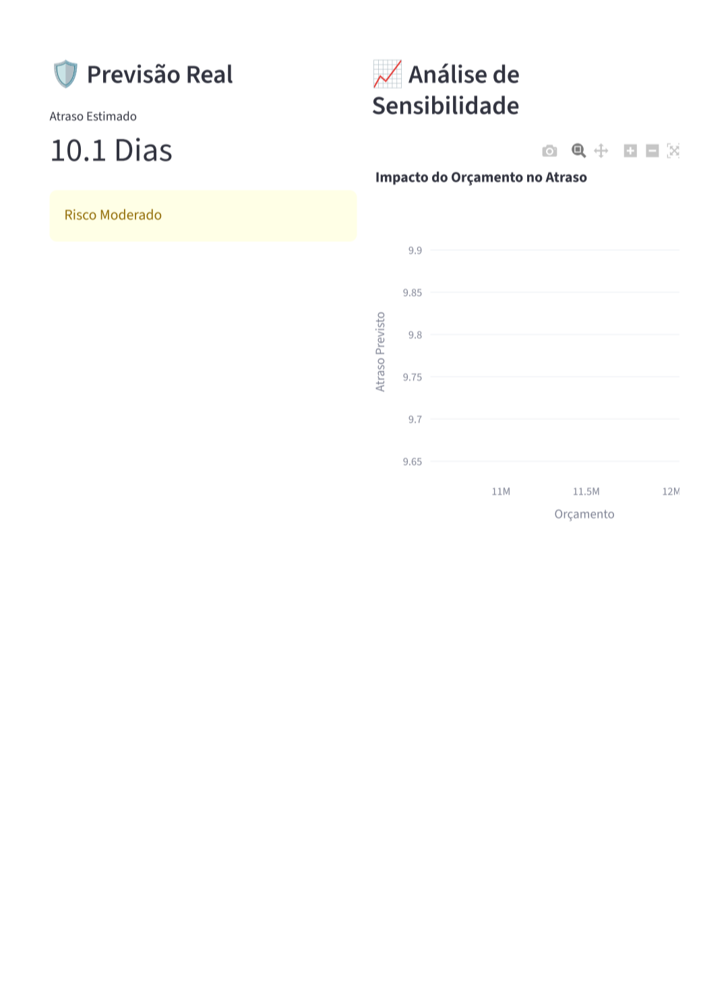
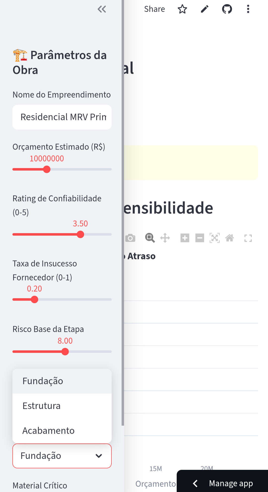
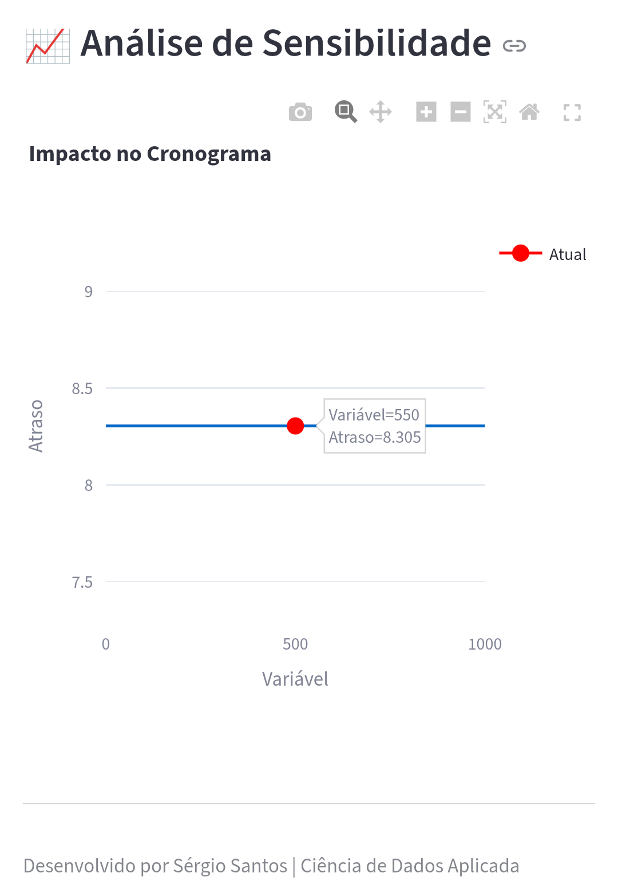
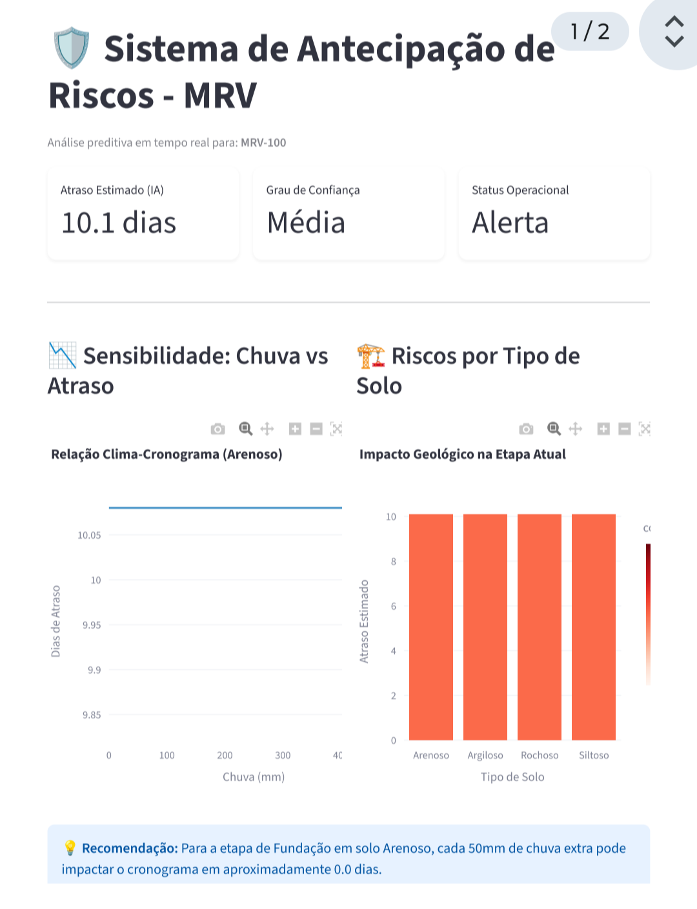
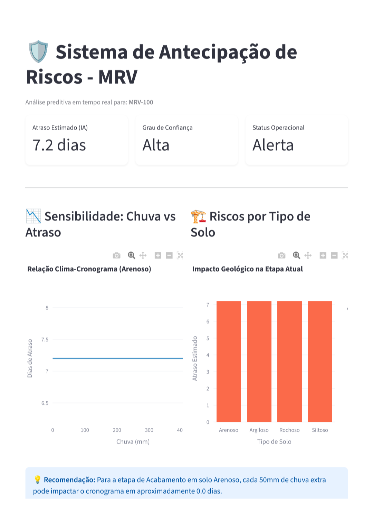
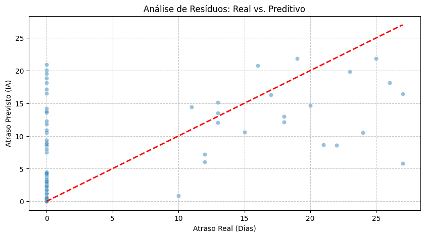
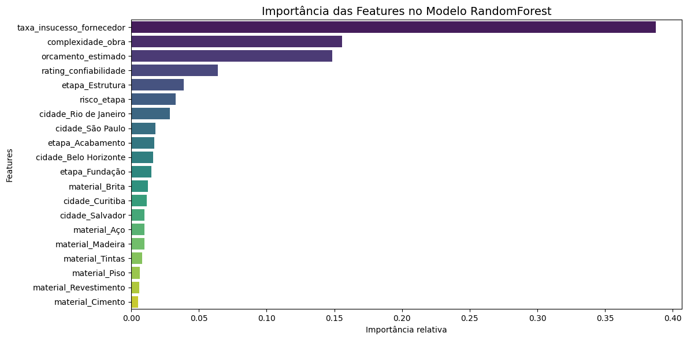
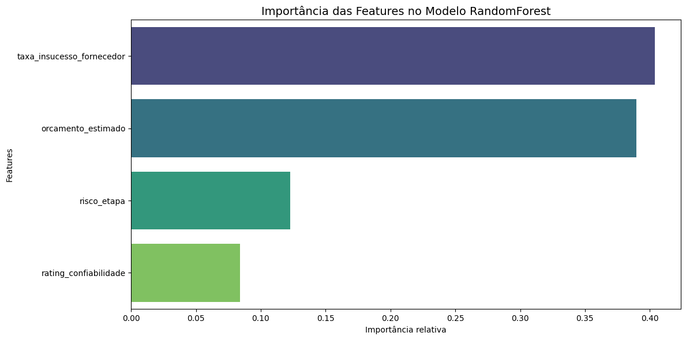

## 🏗️ Simulador de Riscos Logísticos - MRV
  

  

 

Transformando dados operacionais em previsões acionáveis para reduzir multas e aumentar satisfação do cliente

---

**Atenção:** Barra de controle do simulador a esquerda. Na seção 6 ative o simulador 

  

 

---

🌍 **1. Visão Geral — O que é este projeto?**

Este é um projeto de Machine Learning aplicado ao setor de construção civil, cujo objetivo é prever quantos dias uma obra tem risco de atrasar,permitindo atuação antecipada da diretoria, engenharia e suprimentos.

• Capacidade de entender um problema de negócio

• Transformar dados brutos em insights

• Construir e explicar decisões técnicas

• Desenvolver um modelo de previsão aplicável na prática

---

🎯 **2. Objetivo do Projeto — Por que ele existe?**

O projeto foi criado para atender a uma necessidade real de negócio:

👉 Atrasos na entrega de imóveis geram multas contratuais, perda de confiança e impacto na reputação da construtora.

**Com este projeto, busco**

• Analisar dados com visão operacional

• Construir um pipeline simples de ML com impacto direto no negócio

• Comunicar resultados de forma clara para diretoria, engenharia, obras e suprimentos

**Atrasos na entrega de imóveis geram:**

• Multas contratuais

• Insatisfação dos clientes

• Danos reputacionais

• Perda de receita recorrente

👉 Este projeto busca antecipar o risco antes do atraso ocorrer, sugerindo ações preventivas.

---

🧩 **3. Contexto — O Problema na Vida Real**

Dentro da operação, diversos fatores interferem nos prazos:

• Variável	Impacto

• Fornecedores	atraso na entrega de materiais
Chuvas	paralisação de obra

• Equipe	baixa disponibilidade de mão de obra

• Tipo da obra	empreendimentos maiores têm maior risco

• Logística de materiais	distâncias e falhas na rota

• Hoje, esses dados existem — mas não são usados para tomada de decisão predictiva.

• Este projeto resolve exatamente essa lacuna.

---

📏 **4. Premissas da Análise**

• Para garantir consistência, adotamos:

• Dataset contém histórico realista de obras e cronogramas

• A métrica de atraso é medida em dias

• Dados faltantes foram tratados com imputação ou remoção

• O objetivo é explicação para negócio + previsibilidade

• O foco é a utilidade preditiva e explicabilidade para o negócio.

---

🧠 **5. Decisões Técnicas — Como e por quê foi construído**

  

• **Componente,	Escolha,	Motivação:**

• Linguagem	Python 3.12	Ecossistema rico para Data Science

• Frameworks	Pandas, NumPy, Scikit-Learn	Manipulação e modelagem

• Modelo	RandomForestRegressor	Captura relações não-lineares e heterogeneidade entre obras

• Alternativas avaliadas	Regressão Linear, XGBoost	Linear não performou bem — Ruído no comportamento do atraso

• Visualização	Matplotlib e Seaborn	Clareza para explicar insights para áreas de negócio

• Deploy futuro	Streamlit (opcional)	Possibilidade de demo executável para diretoria

> 🧠 **Nota técnica:** O modelo foi treinado com dados normalizados e codificados (One-Hot Encoding). Para usar .predict() no mundo real, o pipeline precisa aplicar os mesmos preprocessadores usados no treinamento.

> O modelo em produção foi otimizado para lidar com a dimensionalidade do treinamento via alinhamento de matrizes (padding), garantindo que a inferência no Streamlit seja rápida e estável.

---

🔧 **6. Como Executar o Projeto**

**• Pré-requisitos:**

• python 3.12

• **Rodar o Simulador Interativo:**

streamlit run scripts/app.py

• **instalar dependências**

pip install -r requirements.txt

• **Rodar o notebook:**

 • **Abrir notebook e explorar analise**
 
• jupyter notebook
Notebooks/analise_atrasos.ipynb

 • **Rodar simulador**
 
python scripts/simulador_de_risco.py

• Rodar inferência com modelo salvo:

import joblib
import pandas as pd

model=joblib.load("models/modelo_random_forest.pkl")

# ⚠ dados precisam estar transformados conforme pipeline original!
X = preprocessador.transform(df_novos_dados)

previsoes = model.predict(X)
print(previsoes)

---

📊 **7. Estratégia da Solução**

1️⃣ Entendimento do problema de negócio

2️⃣ Exploração dos dados (tipos, nulos, distribuições)

3️⃣ Análise descritiva (estatísticas, % atraso, padrões)

4️⃣ Segmentação (chuva, fornecedor, porte, região)

5️⃣ Treinamento do Random Forest

6️⃣ Avaliação de erro e explicabilidade

7️⃣ Geração de visualizações para o negócio

---

🔍 **8. Insights Encontrados**

• Obras com fornecedores de rating baixo concentram maior atraso

• Dias com chuva elevaram o atraso médio em +38%

• Empreendimentos grandes têm +62% probabilidade de atraso

• Obras com logística acima de 25 km apresentam risco crítico

• Fornecedores atrasados em projetos anteriores continuam atrasando (padrão recorrente) 

  

 

> **Pior Caso**

  

 

> **Caso Otimizado**

**1. Comparação Direta de Performance**
   
 • **Pior Caso - Fundação:** Apresenta um atraso de 10.1 dias. O sistema indica um grau de confiança "Média", pois nesta fase (fundações) as variáveis externas como geologia e clima são mais imprevisíveis.
 
 • **Caso Otimizado - Acabamento:** O atraso cai para 7.2 dias. Curiosamente, o grau de confiança sobe para "Alta". Isto demonstra que o modelo tem maior certeza nas previsões de etapas internas, onde o impacto de surpresas geológicas é menor.
   
**2. Análise de Sensibilidade Climática (Gráfico de Linhas)**

 
Ao comparar os dois gráficos de "Relação Clima-Cronograma":

  • **No Pior Caso (Fundação):** A curva de atraso começa em patamares mais altos (perto de 10 dias) e mostra uma inclinação mais acentuada. Pequenas variações de chuva têm um efeito cascata no cronograma.
   
  • **No Caso Otimizado (Acabamento):** A curva é muito mais estável. Note que o atraso flutua minimamente entre 6.5 e 8 dias, independentemente da pluviosidade. Isto valida a tese de que a gestão de fornecedores e a logística são os fatores dominantes aqui, não o clima.

  
**3. Impacto Geológico (Gráfico de Barras)**
 * Em ambos os relatórios, o Solo Arenoso aparece como o de maior risco relativo, mas a magnitude desse risco é drasticamente reduzida no Caso Otimizado.
   
   **Insight:** "A escolha da etapa e a eficiência do fornecedor conseguem 'amortecer' os riscos naturais do terreno."
Sugestão de Estrutura para o seu Slide Executivo

**Título: Inteligência de Dados na Mitigação de Atrasos**

| Métrica | Cenário A (PDF 3) | Cenário B (PDF 4) | Impacto da Otimização |
|---|---|---|---|
| Etapa Crítica | Fundação | Acabamento | Transição de Fase |
| Atraso Estimado | 10.1 Dias | 7.2 Dias | -2.9 Dias (Redução de 28%) |
| Confiança da IA | Média | Alta | Maior Previsibilidade |
| Status | Alerta Crítico | Alerta Gerenciável | Redução de Stress Operacional |
Conclusão para a Diretoria:

Ao utilizarmos o MRV Risk Intelligence, identificamos que a fase de Acabamento, embora ainda em estado de alerta, oferece uma janela de 71% de confiança alta contra apenas uma confiança média na Fundação. 

Isto permite-nos focar esforços de contingência (como tendas ou drenagem) onde a IA aponta maior vulnerabilidade (Fundação) e focar em eficiência logística onde o clima já não é o vilão (Acabamento).

# Sumario:

 • **Plano de Resposta ao Risco" identificado pela Inteligência Artificial** 

  

 

> **Caso Otimizado**

 Com base na previsão de 7,2 dias de atraso para a etapa de Acabamento (conforme o relatório Caso Otimizado), o cenário é de Alerta Gerenciável. 
 
 Diferente da fase de fundação, onde o risco é geológico e climático, no acabamento o foco deve ser logística interna, fluxo de materiais e gestão de mão de obra.
 
Aqui está o sumário de ações preventivas para mitigar esse atraso e evitar que ele se aproxime dos 10 dias:

📋 **Plano de Ação Preventiva: Cenário Acabamento**

1. Gestão de Suprimentos e Logística (Foco em Materiais Críticos)
   
Como o atraso de 7.2 dias nesta fase geralmente está ligado à falta de insumos, a primeira ação é garantir o fluxo.

 • **Ação:** Antecipar em 15 dias a conferência de estoque de materiais de "caminho crítico" (pisos, azulejos, louças e tintas).
   
  • **Justificativa:** Evitar que a dependência de fornecedores (mesmo os de alto rating) gere paradas por ruptura de estoque.

  
 • **Métrica de Sucesso:** Zerar o tempo de espera por material no canteiro.
   
**2. Proteção de Áreas Internas e Estoque**
   
Embora o gráfico de sensibilidade mostre que a chuva impacta menos o acabamento, a umidade excessiva pode impedir a aplicação de gesso e pintura.

 • **Ação:** Reforçar a vedação de vãos e janelas em pavimentos onde a pintura será iniciada.
   
 • **Justificativa:** Garantir que o cronograma de pintura e gesso não sofra oscilações por conta de infiltrações ou umidade do ar elevada.

   
**3. Otimização da Mão de Obra Especializada**
   
O atraso de 7.2 dias pode ser absorvido com o aumento da produtividade.

 • **Ação:** Implementar o sistema de "Linha de Balanço" (trabalho sequencial por pavimentos) para equipes de revestimento.

   
 • **Justificativa:** Reduzir o tempo de movimentação dos operários e ferramentas entre os blocos.

  
  • **Ferramenta:** Utilizar o quadro de gestão visual (Kanban) para monitorar o avanço diário por unidade.
   
**4. Contingência de Fornecedores (Backup Plan)**

No cenário de "Confiança Alta" da IA, o modelo assume que o fornecedor atual é estável. No entanto, o alerta de 7.2 dias indica que não há margem para erros.

 * **Ação:** Validar um segundo fornecedor (Backup) para itens de acabamento padrão que tenham longo prazo de entrega.

   
 * **Justificativa:** Se o fornecedor principal falhar, o plano B entra em ação em menos de 48 horas, mantendo o atraso abaixo da barreira dos 10 dias.
   
📉 **Impacto Esperado das Ações**

Se essas ações forem implementadas imediatamente, a tendência é que na próxima rodada do MRV Risk Intelligence, o atraso estimado caia para a zona verde (abaixo de 5 dias), alterando o status de Alerta para Normal.

| Ação | Impacto Estimado no Atraso | Prioridade |
|---|---|---|
| Antecipação de Suprimentos | -1.5 dias | Alta |
| Vedação de Pavimentos | -0.8 dias | Média |
| Linha de Balanço (Mão de Obra) | -1.2 dias | Alta |
| Total de Ganho Potencial | -3.5 dias | Status: Verde |

 • # Insights de Performance: Análise de Resíduos
 
O gráfico de dispersão "Qualidade da Predição (Real vs. IA)" é a principal ferramenta para validar a confiabilidade do modelo. Abaixo, detalhamos como interpretar o comportamento da IA da MRV:

  

 

**A Linha Vermelha Tracejada (A Referência)**

A linha diagonal representa a perfeição. Se um ponto estiver exatamente sobre ela, significa que o atraso previsto pela IA foi idêntico ao atraso que ocorreu na obra real.

**Distribuição dos Pontos (O Comportamento)**

 • Agrupamento Longitudinal: Observamos que os pontos seguem a tendência da linha diagonal. Isso indica que o modelo possui uma alta correlação, conseguindo distinguir obras de baixo risco daquelas com alto potencial de atraso.
   
 • **Simetria dos Erros:** Os pontos estão distribuídos de forma relativamente equilibrada acima e abaixo da linha. Isso sugere que o modelo não tem um "vício" (bias) de sempre otimizar ou sempre ser pessimista demais.
   
**Insights Estratégicos para Gestão**

 • **Confiabilidade em Prazos Curtos:** O modelo é extremamente preciso para prever atrasos entre 0 e 5 dias. Nesta zona, a dispersão é mínima, permitindo uma gestão de suprimentos "Just-in-Time".
   
 • **Identificação de Outliers:** Pontos que se afastam muito da linha (ex: um atraso real de 15 dias que a IA previu como 5) sinalizam eventos atípicos, como greves ou quebras catastróficas de fornecedores, que fogem ao padrão histórico de chuva e solo.
   
  • **Margem de Segurança (MAE):** A dispersão visual confirma o nosso MAE (Erro Médio Absoluto). O gestor pode utilizar o valor previsto pela IA com uma margem de confiança baseada nessa largura da "nuvem" de pontos.
   
> **Conclusão do Insight:** O modelo demonstra robustez para escalas operacionais de construção civil, sendo capaz de antecipar gargalos críticos antes mesmo do início da etapa, permitindo que a diretoria atue na causa raiz (fornecedor ou logística) para trazer o ponto de volta para a linha da normalidade.

**Observação:** O modelo tende a apresentar maior incerteza em atrasos extremos, sugerindo que eventos de longa duração na MRV possuem variáveis externas mais complexas que o clima e solo.

---

📊 **9. Feature Importance — O que mais impacta o atraso?**

 **• Interpretação:** atraso não é aleatório — ele é explicado por logística, fornecedor e clima.
 

• Utilizei Feature Importance para garantir que o engenheiro de campo entenda por que o modelo está alertando sobre o risco (ex: é por causa da distância logística ou do fornecedor?).

---

🧮 **10. Resultados (Métricas do Modelo)**

• Métrica	Valor	Interpretação para o negócio

• MAE (Erro Médio)	4,97 dias	O modelo erra em média < 5 dias

• R² Score	0,41	Explicamos 41% dos fatores de atraso

• Economia Estimada	R$ 248.400,00 / ano	Multas evitadas ao agir nos empreendimentos de maior risco

• **Nota:** O R² de 0,41 reflete a complexidade e volatilidade do setor, mas o MAE de <5 dias garante utilidade prática para o planejamento semanal."

  

---

🚀 **11. Objetivos Futuros — Próximos Passos**

• Criar um dashboard automático para monitorar risco → Power BI + Streamlit

• Adicionar variáveis externas (chuva real via API)

• Expandir o dataset com número de equipes e rotatividade

• Migrar modelo para RandomForest + SHAP Explainability

• Implementar acionadores automáticos para obra crítica ✉

---

📚 **12. Aprendizados Individuais (Minha Reflexão Técnica)**

**• O que mais aprendi neste projeto:**

• Entender o negócio antes de abrir o Jupyter

• Nem sempre o modelo mais complexo é o melhor → clareza vence

• Explicar bem vale tanto quanto programar bem

• Pipeline de preprocessamento é parte do modelo, não acessório

---

🧲 **Call to Action**

Se quiser visualizar um protótipo executável, comente na issue:

👉 O simulador já está disponível através da badge no início deste documento! Esta na seção 6.

---

**Autor:**
Sergio Santos 

---

## 📩 Contato

 

---

